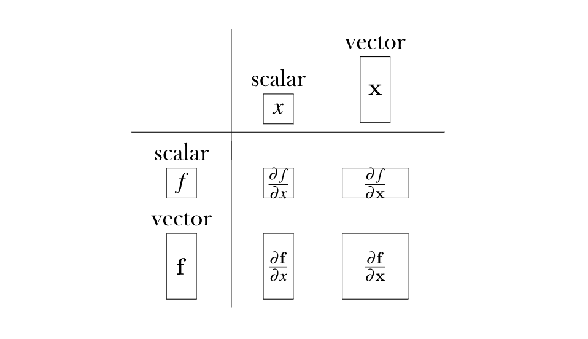
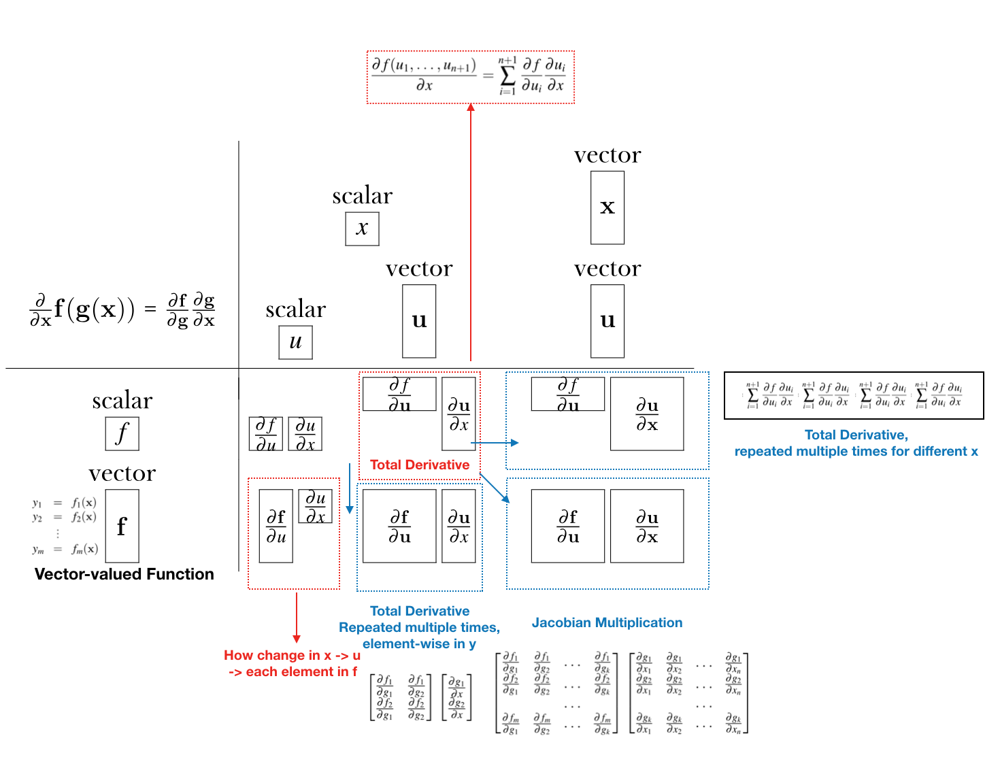
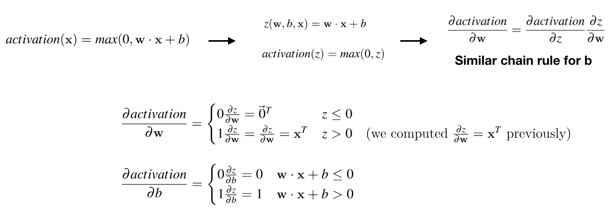
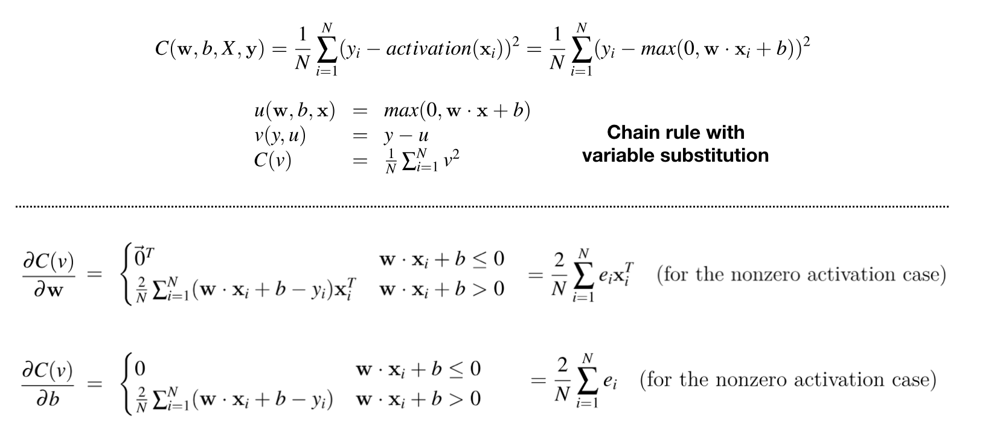

# Backward Propogation

Once you understood the [basic architecture of Neural Network and common loss functions](https://github.com/robert8138/deep-learning-deliberate-practice/blob/master/concepts/neural_network_architecture_basics.md), you will be able to **forward pass** (`x` -> `z` -> `a` -> `y`) an unseen example and make prediction on that example, we sometimes called this **inference**. 

However, in order to perform such inference task, we must first **train** the model (where all the learning happens). Optimization procedure such as stochastic gradient descient (or variant of) would be used for learning. I have a fairly detailed summary of SGD [here](https://github.com/robert8138/deep-learning-deliberate-practice/blob/master/concepts/learning_algorithms.md), so will not go into the details here. The key idea to remember is that we are updating the parameters, typically `W` and `b`, in the negative gradient direction of the loss function to minimize loss:

One of the mathematical breakthrough for training deep neural network was the invention of backward propagation (backprop in short) - think of it as a smart way of computing derivatives of the loss w.r.t any parameters in the network. Instead of carefully tracking all the paths in which the parameter (in the network) would affect the final cost function (and sum up the derivatives along the way), backward propgation do things backward, where you only need to keep track of gradient from upstream + local gradient. Colah explains this in his great post [Calculus on Computational Graphs: Backpropagation](http://colah.github.io/posts/2015-08-Backprop/) in much greater details.

Even though backward propgation is very efficient, the mathematics for backprop can be confusing, mostly because the derivation involves a lot of matrix calculus and careful indices tracking. Luckily, there are a lot of great materials out there to help you gain practice on matrix calculus. The best one I have seen so far came from Jeremy Howard, called [Matrix Calculus for Deep Learning](http://parrt.cs.usfca.edu/doc/matrix-calculus/index.html). Justin Johnson also has some nice [notes](http://cs231n.stanford.edu/2017/handouts/derivatives.pdf) that explains how dimensions of matrix derivatives work. 

With these tools at hand, I was able to follow along [Michael Nielsen's Detailed Explanation on Backprop](http://neuralnetworksanddeeplearning.com/chap2.html) and carry out my own derivation of the four fundamental equations for backprop (see [here](https://github.com/robert8138/deep-learning-deliberate-practice/blob/master/concepts/pictures/backprop_math_by_hand.png)).

Finally, while it's intellectually satisfying to go back to my roots and do proofs, It is worth reading Andrej Karparthy's nice post [Yes You Should Understand Backprop](https://medium.com/@karpathy/yes-you-should-understand-backprop-e2f06eab496b) and Michael Nielsen's [Why are deep neural networks hard to train?](http://neuralnetworksanddeeplearning.com/chap5.html) to learn why knowing how to derive the equations for backprop is very useful for studying challenging for training deep models, such as **vanishing gradient problem**. 

With Matrix Calculus under your belt, basic exercise for proving the general backprop equations for neural networks, and examples on how to analyze the gradients, we are one step closer to reading and studying how other, more exotic, learning algorithm works (e.g. `dCost / dX`, where we optimize the input `x`, rather than the parameters `w` and `b`).

## Table of Contents

### Intuition on Backprop

* [Calculus on Computational Graphs: Backpropagation](http://colah.github.io/posts/2015-08-Backprop/)
	* [Computational Graph](https://github.com/robert8138/deep-learning-deliberate-practice/blob/master/concepts/backward_propogation.md#computational-graph)
	* [Forward-mode Differentiation](https://github.com/robert8138/deep-learning-deliberate-practice/blob/master/concepts/backward_propogation.md#forward-mode-differentiation)
	* [Backward-mode Differentiation](https://github.com/robert8138/deep-learning-deliberate-practice/blob/master/concepts/backward_propogation.md#backward-mode-differentiation)
	* [Summary](https://github.com/robert8138/deep-learning-deliberate-practice/blob/master/concepts/backward_propogation.md#summary)

### Matrix Calculus

* [Justin Johnson's notes on Derivatives, Backpropagation, and Vectorization](http://cs231n.stanford.edu/2017/handouts/derivatives.pdf)
	* [Derivative Mnemonic](https://github.com/robert8138/deep-learning-deliberate-practice/blob/master/concepts/backward_propogation.md#derivative-mnemonic)
* [Matrix Calculus for Deep Learning](http://parrt.cs.usfca.edu/doc/matrix-calculus/index.html)
	* [Derivative Map](https://github.com/robert8138/deep-learning-deliberate-practice/blob/master/concepts/backward_propogation.md#derivative-map)
	* [Chain Rule Map](https://github.com/robert8138/deep-learning-deliberate-practice/blob/master/concepts/backward_propogation.md#chain-rule-map)

### Derivation of Backprop Equations

* [Special Case: Jeremey Howard's one-layer derivation with RELU activation](https://github.com/robert8138/deep-learning-deliberate-practice/blob/master/concepts/backward_propogation.md#jeremy-howards-proof-for-gradient-of-w-and-b)
* [Michael Nielsen's Detailed Explanation on Backprop](http://neuralnetworksanddeeplearning.com/chap2.html)
* My own derivation of 4 fundamental equations for backprop is written [here](https://github.com/robert8138/deep-learning-deliberate-practice/blob/master/concepts/pictures/backprop_math_by_hand.png)

### Intuition on Backprop & Why Backprop Makes Training Hard

* [Yes You Should Understand Backprop](https://medium.com/@karpathy/yes-you-should-understand-backprop-e2f06eab496b)
* [Why are deep neural networks hard to train?](http://neuralnetworksanddeeplearning.com/chap5.html)

## Calculus on Computational Graphs

Backpropagation is the key algorithm that makes training deep models computationally tractable. For modern neural networks, it can make training with gradient descent as much as ten million times faster, relative to a naive implementation. That’s the difference between a model taking a week to train and taking 200,000 years.

Beyond its use in deep learning, backpropagation is a powerful computational tool in many other areas, ranging from weather forecasting to analyzing numerical stability – it just goes by different names. In fact, the algorithm has been reinvented at least dozens of times in different fields (see Griewank (2010)). The general, application independent, name is “reverse-mode differentiation.”

Fundamentally, it’s a technique for calculating derivatives quickly. And it’s an essential trick to have in your bag, not only in deep learning, but in a wide variety of numerical computing situations. Colah's post doesn't go into the details of explaining the derivation of gradient for DL, but it explains why backprop is and efficient algorithm for computing derivatives in a graph.

### Computational Graph

First, Colah explains how evaluation of mathematical expression can be abstracted as computational graphs. In some sense, a computational graphs describes, step by step, how a complicated expression should be evaluated. This step doesn't involve any derivatives, it simply just add structure to how expressions should be evaluated.

### Forward-Mode Differentiation

Now, when we start thinking about derivatives (how changing the input would affect the output), our natural instinct is to go through the exercise of tracking forward, how changing `x` would affect `z`, and how changing `z` would affect `a`, and how changing `a` would affect the final output `y`. Naturally, we would start to see that in order to track how input `x` would affect the output `y`, we would need to sum up all possible paths forward. Formally, this is called **Forward-mode differentiation**. Forward-mode differentiation starts at an input to the graph and moves towards the end. At every node, it sums all the paths feeding in. Each of those paths represents one way in which the input affects that node. By adding them up, we get the total way in which the node is affected by the input, it’s derivative.

### Backward-Mode Differentiation

Reverse-mode differentiation, on the other hand, starts at an output of the graph and moves towards the beginning. At each node, it merges all paths which originated at that node. It's a lot less intuitive to think about "rate of change" this way, because you are doing backward, but this is enormous advantages for computing derivatives of complex expressions.

When training neural networks, we think of the cost (a value describing how bad a neural network performs) as a function of the parameters (numbers describing how the network behaves). We want to calculate the derivatives of the cost with respect to all the parameters, for use in gradient descent. Now, there’s often millions, or even tens of millions of parameters in a neural network. So, reverse-mode differentiation, called backpropagation in the context of neural networks, gives us a massive speed up!

Here is another way to think about backprop: when thinking about `dCost / dw`, where the lineage from `w` to `Cost` involves a lot of forward path, so the total derivative involves a lot of sum, the backward prop leverage the fact that `dCost/dw` can be thought of "backward" as `dCost/d local_variable * d local_variable / dw`. The beauty of the backward pass is that if we work backward, when we go from layer `l+1` to `l`, we will compute all the graidents from later layers already, this makes `dCost/d local_variable * d local_variable / dw` a lot easier. In short, you only have to worry about local gradient, the upstream gradient `dCost/d local_variable` is already taken care for you because we do it in a backward fashion.

### Summary

Forward-mode differentiation tracks how one input affects every node. Reverse-mode differentiation tracks how every node affects one output. That is, forward-mode differentiation applies the operator `∂/∂X` to every node, while reverse mode differentiation applies the operator `∂Z/∂` to every node. 

Are there any cases where forward-mode differentiation makes more sense? Yes, there are! Where the reverse-mode gives the derivatives of one output with respect to all inputs (case for neural network), the forward-mode gives us the derivatives of all outputs with respect to one input. If one has a function with lots of outputs, forward-mode differentiation can be much, much, much faster.

More generally, there is a broad algorithmic lesson to take away from these techniques. Backpropagation and forward-mode differentiation use a powerful pair of tricks (linearization and dynamic programming) to compute derivatives more efficiently than one might think possible.

Finally, the idea of computational graph and algorithmic computing derivatives from output back to parameters is what makes automatic differentiation in all the major deep learning framework possible!

## Matrix Calculus

As I mentioned ealrier, the challenging things about deriving the backward propgation equations is the fact that we are dealing with vector-valued function whose input is also a vector. This brings us to the realm of **Matrix Calculus**, a area that might not be familiar to all people even if they have taken an introductory Calculus class.

I fortunately have taken Multivariate Real Analysis & Measure Theory in college, so I have been through some of the pains in learning about Jacobian Matrix, etc. That said, being proficient in taking derivatives of vector-valued function is still challenging, and I think the most confusing thing is **tracking dimension** of the derivatives, which can be scalar, column vector, row vector (column vector transposed), Jacobian Matrix, or even a generalized tensor. 

In the next two sections, I will summarize what I think is the best way to think about derivatives, even when the dimensions can be confusiong.

### Justin Johnson's Notes on Tensor Derivative

#### Derivative Mnemonic

Most of the inspiration in this section is from Justin Johnson's [notes on Derivatives, Backpropagation, and Vectorization](http://cs231n.stanford.edu/2017/handouts/derivatives.pdf). The main concept from Justin Johnson's notes is the following: **Derivatives are a way to measure change**. Concretely, if if `x` were to change by `ε` then `y` will change by approximately `ε * ∂y/∂x`. We can write this relationship as:

You should read this as saying “changing x to x + ∆x implies that y will change to approximately y + ∆x * ∂y/∂x”. This notation is nonstandard, but it emphasizes the relationship between changes in x and changes in y. What I like about this way of thinking the most is that it makes tracking the dimension of `∂y/∂x` a lot easier. How? Let's see a few cases:

* **Graident Dimension: Scalar in, Scalar out**: In this case, `∂y/∂x` is simply a `1 x 1` "matrix".
* **Graident Dimension: Vector in, Scalar out**: In this case, `∂y/∂x` needs to be a `1 x N` row vector to make it work. We can also see that total derivative is at work here, we are summing all the input contribution from `x_i` to the final output `y`.
* **Graident Dimension: Scalar in, Vector out**: In this case, `∂y/∂x` needs to be a `M x 1` column vector to make it work. We can see that the change in `x` is affecting each element of `y_j, j=1...M` independently.
* **Graident Dimension: Vector in, Vector out**: In this case, `∂y/∂x` needs to be a `M x N` Jacobian Matrix. We see that the change in each `y_j` is affected by each and every `x_i` in the input.
* **Gradient Dimension: Tensor in, Tensor out**: In this case, `∂y/∂x` will need to be tensors, see Johnson's notes for more details. 

Justin also talked about how chain rule would work in each cases, and they are generally multiplication of vectors/matrices/tensors of different dimensions. I will ignore them here, since I believe Jeremy's treatment on chain rule is more detailed.

### Jeremy Howard's Matrix Calculus

#### Derivative Map

In this document, Jeremey and Terence also went through different scenarios of input/output to describe what the derivatives for each case would look like. I think his picture summarizes all:

There are a few more details that he discussed, such as **Derivatives of vector element-wise binary operators (N->M)** (where derivative is a Jacobian matrix), **Derivatives involving scalar expansion (1->N)** (where derivative is typically a column vector), and **Vector sum reduction (N->1)** (where derivative is typically a row vector).

#### Chain Rule Map

While these are all really useful, I thought the most useful material from his post is the way that chain rule is explained, step by step, using variable substitution. Furthermore, Jeremy and Terence carefully explains the concept of total derivative, which is equivalent to summing all the paths how x would affect u_vector, and u_vector would affect the final scalar f. Overall, the most useful picture is from below:

After keeping these "dimension maps" in mind, I think it becomes easier to recognize what is the proper dimension of the derivative, by thinking carefully about the dimension of the input and the output. This is an important pre-requsite for computing the gradient of `w` and `b` for neural network.

## Derivation of Backprop Equations

### Jeremy Howard's Proof for Gradient of `w` and `b`

#### First, derivative of activation w.r.t `w` and `b`

After some careful derivative tracking, we can see that `da/dw` and `da/db` looks like the following:

Now, with `da/dw` and `da/db` (which we typically called **local gradient**), we can connect it back to the derivatives of the cost function:

This is, of course, just a warm-up exercise (because it's only one-layer and it uses RELU as its specific activation function). The full derivation is explained by Michael Nielsen's post (see next section), where he uses different choices for upstream gradient `dC/dz` and local gradient `dz/dw` and `dz/db`.

### Michael Nielsen's Detailed Explanation on Backprop

Unlike Colah's post, this long posts goes into detail explaining the math, notation, derivation of how backprop works in the context of Neural Networks. It's a really good read. To summarize, it:

* First introduced the notation (and explain why they are set up that way)

* Lay out the four fundamental equations for backprop:
	* An equation for the error in the output layer: `δL`
	* An equation for the error `δl` in terms of the error in the next layer, `δl+1`
	* An equation for the rate of change of the cost with respect to any bias in the network (`dCost/db`)
	* An equation for the rate of change of the cost with respect to any weight in the network (`dCost/dw`)

* It also goes into proving 2 of the 4 fundamental equations (I derived this myself, see [here](https://github.com/robert8138/deep-learning-deliberate-practice/blob/master/concepts/pictures/backprop_math_by_hand.png))
* It then lays out the backprop algorithm with SGD with mini-batch
* It shows Python code snippets for backprop
* It explains why it's much faster than forward propogation
* It then talks about a bit of the history of how backprop was discovered (Answer: a lot of hardwork in using forward pass reasoning and simplifying the math)

## Intuition on Backprop & Why Backprop Makes Training Hard

### Yes You Should Understand Backprop

A Medium post from Andre Karpathy explaining why every practitioners should learn about how backprop works. Essentially, his arguments is that even when doing DL in practice, if the activations are saturated, the gradient can become very close to 0 (vanishing gradient problem), causing the weight updates to be super slow, and in terms make the cost function to go down very slowly.

### Why Training Neural Network Is Hard

