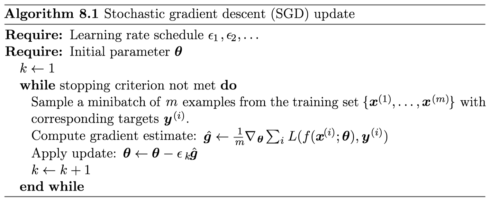
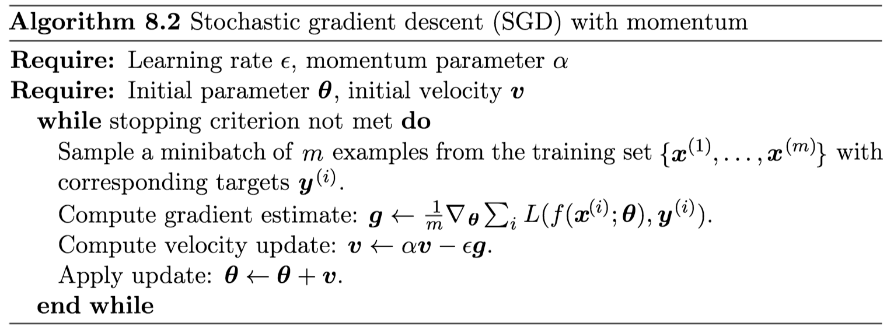
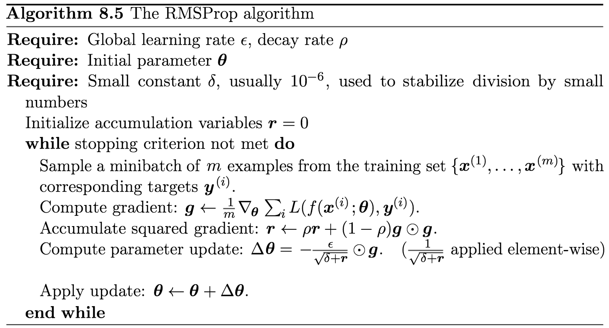
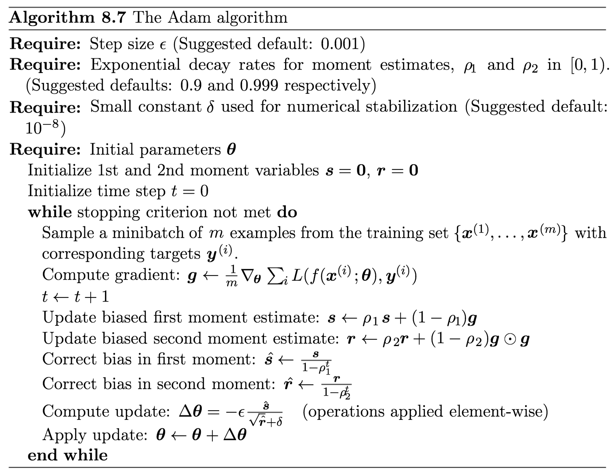

# Optimization

_This section is largely adapt from Ian Goodfellow's Deep Learning textbook and Andrew Ng's Deep Learning Specialization Coursera series._

## Table of Contents (AKA Major Concept Map)

* [How Learning Differs From Traditional Optimization Problem](https://github.com/robert8138/deep-learning-deliberate-practice/blob/master/concepts/optimization.md#how-learning-differs-from-traditional-optimization-problem)

* [Challenges in Neural Network Optimization](https://github.com/robert8138/deep-learning-deliberate-practice/blob/master/concepts/optimization.md#challenges-in-neural-network-optimization)
	* [Ill-conditioning Hessian Matrix](https://github.com/robert8138/deep-learning-deliberate-practice/blob/master/concepts/optimization.md#ill-conditioning)
	* [Local Minima](https://github.com/robert8138/deep-learning-deliberate-practice/blob/master/concepts/optimization.md#local-minima)
	* [Saddle Points](https://github.com/robert8138/deep-learning-deliberate-practice/blob/master/concepts/optimization.md#saddle-points)
	* [Gradient Cliffs](https://github.com/robert8138/deep-learning-deliberate-practice/blob/master/concepts/optimization.md#gradient-cliffs)
	* [Vanishing and Exploding Gradients](https://github.com/robert8138/deep-learning-deliberate-practice/blob/master/concepts/optimization.md#vanishing-and-exploding-gradients)

* [Gradient Descent](https://github.com/robert8138/deep-learning-deliberate-practice/blob/master/concepts/optimization.md#gradient-descient): Batch, Stochastic, Mini-batch

* [More Advanced Gradient-based Methods](https://github.com/robert8138/deep-learning-deliberate-practice/blob/master/concepts/optimization.md#more-advanced-gradient-based-methods)
	* [Momentum](https://github.com/robert8138/deep-learning-deliberate-practice/blob/master/concepts/optimization.md#sgd-with-momentum)
	* [RMSprop](https://github.com/robert8138/deep-learning-deliberate-practice/blob/master/concepts/optimization.md#sgd-with-rmsprop)
	* [Adam](https://github.com/robert8138/deep-learning-deliberate-practice/blob/master/concepts/optimization.md#adam)

* [Initialization](https://github.com/robert8138/deep-learning-deliberate-practice/blob/master/concepts/optimization.md#initialization)

* [Batch Normalization](https://github.com/robert8138/deep-learning-deliberate-practice/blob/master/concepts/optimization.md#batch-normalization)

## How Learning Differs From Traditional Optimization Problem

Optimization algorithms used for training of deep models differ from traditional optimization algorithms in several ways. Machine learning usually acts indirectly. In most machine learning scenarios, we care about some performance measure `P`, that is defined with respect to the test set and may also be intractable. We therefore optimize `P` only indirectly. We reduce a different cost function `J(θ)` in the hope that doing so will improve `P`. This is in contrast to pure optimization, where minimizing `J` is a goal in and of itself.

More formally, we would usually prefer to minimize the corresponding objective function where the expectation (of generalization error) is taken across the data-generating distribution `p_data` rather than just over the finite training set, we call this true expectation **risk**. If we know the true underlying distribution, risk minimization would be an optimization task solvable by an optimization algorithm.

When we do not know `pdata(x, y)` but only have a training set of samples, however, we have a machine learning problem. The simplest way to convert a machine learning problem back into an optimization problem is to minimize the expected loss on the training set. This means replacing the true distribution `p(x, y)` with the empirical distribution `ˆp(x, y)` defined by the training set. We now minimize the **empirical risk**. 

The training process based on minimizing this average training error is knownasempirical risk minimization. In this setting, machine learning is still verysimilar to straightforward optimization. Rather than optimizing the risk directly,we optimize the empirical risk and hope that the risk decreases significantly aswell. A variety of theoretical results establish conditions under which the true riskcan be expected to decrease by various amounts.

## Challenges in Neural Network Optimization

There are many potential issues with Neural Network Optimization, we list a few main ones here:

### Ill-conditioning

The intuition behind ill-conditioning Hessian is that learning becomes very slow despite the presence of a strong gradient because the learning rate must be shrunk to compensate for even stronger curvature (i.e. the decrease in the loss function is over-compensated by the increase in the curvature). In cases where we suspect the Hessian matrix is ill-conditioned, one should monitor the squared gradient norm `gTg` and `gTHg` terms.

### Local Minima

One of the most prominent features of a convex optimization problem is that itcan be reduced to the problem of finding a local minimum. Any local minimum isguaranteed to be a global minimum. Some convex functions have a flat region atthe bottom rather than a single global minimum point, but any point within sucha flat region is an acceptable solution. When optimizing a convex function, weknow that we have reached a good solution if we find a critical point of any kind.

With nonconvex functions, such as neural nets, it is possible to have manylocal minima. Indeed, nearly any deep model is essentially guaranteed to havean extremely large number of local minima. As we will see, however, this is notnecessarily a major problem.

Today, that does not appear to be the case. The problem remains an active area of research, but experts now suspect that, for sufficiently large neural networks, **most local minima have a low cost function value**, and that it is not important to find a true global minimum rather than tofind a point in parameter space that has low but not minimal cost

### Saddle Points

Nowadays, it's generally believe that in a high dimensional model like Neural Network, local minima is less of a problem, there are **more chances of seeing saddle points**. Why are there more presence of saddle points than local minima? 

Here is the intuition: At a saddle point, the Hessian matrix has both positive and negative eigenvalues, whereas the Hessian matrix at a local minimum has only positive eigenvalues. Imagine that the sign of each eigenvalue is generated by flipping a coin, it's much easier to get a saddle point than to have all signs to be positive (local minima).

What are the implications of the proliferation of saddle points for trainingalgorithms? For first-order optimization, algorithms that use only gradient infor-mation, the situation is unclear. The gradient can often become very small near asaddle point. On the other hand, gradient descent empirically seems able to escapesaddle points in many cases.

### Gradient Cliffs

Neural networks with many layers often have extremely steep regions resembling cliffs. These result from the multiplication of several large weights together. On the face of an extremely steep cliff structure, the gradient update step can move the parameters extremely far, usually jumping offthe cliff structure altogether.

The typical solution to avoid updating by a large gradient direction is to use **gradient clipping**. The gradient clipping heuristic intervenes to reduce the step size, making it less likely to go outside the region where the gradient indicatesthe direction of approximately steepest descent.

### Vanishing and Exploding Gradients

Another difficulty that neural network optimization algorithms must overcomearises when the computational graph becomes extremely deep. This is especially relevant for Recurrent Neural Network, where the same weight matrix `W` is being applied in each time step. Andrej Karpathy explained this problem in his blog post ["Yes, you should understand backprop"](https://medium.com/@karpathy/yes-you-should-understand-backprop-e2f06eab496b) really well.

The vanishing and exploding gradient problem refers to the fact that gradients through such a graph are also scaled according to `diag(\lambda)^t`. Vanishing gradientsmake it difficult to know which direction the parameters should move to improvethe cost function, while exploding gradients can make learning unstable.

## Gradient Descient

Andrew's DL specialization, especially [Course 2: Improving Deep Neural Networks: Hyperparameter tuning, Regularization and Optimization](https://www.coursera.org/learn/deep-neural-network/home/welcome), in my opinion, does the best job in explaining the topics of optimization and graident descient. 

After learning the basics about Neural Network, the parameters involved, and the loss function formulation, the main concept is then to minimize the loss function, given the input parameters. This is fundamentally an optimization problem. Because the functional form of a Nueral Network can be unwieldy, numerical optimizations are the best way to approach this.

Of all the numerical approaches, *gradient descent* is one of the most fundamental approaches, but many additional ideas have been developed, such as **momentum**, **RMSProp**, **ADAM**, all aim to speed up the process for the graident to reach the minimum. 

* [**Understand Gradient Descent**](http://cs231n.github.io/optimization-1/): By now, I kind of take this for granted already. But Stanford's CS 231N did a good job in explaining how we can approach optimization (random search, random local search, or follow the graident). It can be shown, mathematically, that moving in the direction of the gradient, is the most efficient.

* **How Far Should I move my gradient?** _The choice of how many training examples to process to update the gradient can be a very important choice_.

	* **Batch Gradient Descent**: This is known as taking one complete pass of the training data TOGETHER, and calculating the gradient over the entire training data, and update gradient once. We can do this efficiently using vectorization, but sometimes we can overshoot because the gradient takes a large step.

	* **Stochastic Gradient Descent**: The other extreme, where we take one example as ONE pass, so we are only calculating the gradient over one training example. The advantage of this is that we can move by a mini-step, but then we lose all the advantages of vectorization.

	* **Mini-batch Gradient Descent**: This is the preferred choice, where we take mini-batches of the training data, so we do not take a complete pass of the entire training data. Instead, we take small batches of it, so it might take several rounds before we take one pass (i.e. one epoch). The advantage is that we can average out the gradient direction where it has high variance, while enjoying vectorization.

## More Advanced Gradient-based Methods

Deep Learning researchers have been doing a lot of work to speed up the optimization routines, but it turns out that a lot of them do not generalized well, the ones that do generalized well involved calculating the **expoential weighted averages** of the first and second moment of the gradients.

### Exponential Weighted Average

[**Exponential Weighted Average**](https://www.coursera.org/learn/deep-neural-network/lecture/Ud7t0/understanding-exponentially-weighted-averages): I love Andrew's explanation on this topic, it's the math behind these newer optimization routines. The idea is that we will take the exponential weighted average of the first & second moment of the gradient, to smooth up the updates.

### SGD with Momentum

[**Gradient Descent Momentum**](https://www.coursera.org/learn/deep-neural-network/lecture/y0m1f/gradient-descent-with-momentum): The key idea is to imagine that you have a optimization problem with poor conditioning of the Hessian Matrix (geometrically, this corresponds to a very narrow, long countour surface area with steep walls). 

Without momentum, typical gradient descent would just traverse and oscillate between the sides of the walls, but with momentum ,it will average out / smooth out the gradients using exponential weighted average, to make the gradient more centered / less brittle. Essentially, instead of updating by learning_rate * gradient, we update `learning_rate * exponential_weighted_avg(gradient)`

### SGD with RMSprop

[**Gradient Descent with RMSprop**](https://www.coursera.org/learn/deep-neural-network/lecture/BhJlm/rmsprop): The key idea is to update less aggressively on gradient directions that are volatile, and update more aggressively on gradient directions that are stable. Instead of updating by learning_rate * gradient, we update `learning_rate * gradient / exponential_weighted_avg(gradient ** 2)`

### ADAM

[**ADAM**](https://www.coursera.org/learn/deep-neural-network/lecture/w9VCZ/adam-optimization-algorithm): This combines Momentum & RMSprop, so not only do we average out the brittle gradient direction, we update more aggressively on gradient directions that are stable, and less aggressively on gradient directions that are volatile. Update by `learning rate * exponential_weighted_avg(gradient) / exponential_weighted_avg(gradient ** 2)`

## Initialization

Some optimization algorithms are not iterative by nature and simply solve for a solution point. Other optimization algorithms are iterative by nature but, when applied to the right class of optimization problems, converge to acceptable solutions in an acceptable amount of time regardless of initialization. Deep learning training algorithms usually do not have either of these luxuries. Training algorithms for deep learning models are usually iterative and thus require the user to specify someinitial point from which to begin the iterations.

Perhaps the only property known with complete certainty is that the initial parameters need to “break symmetry” between different units. If two hidden units with the same activation function are connected to the same inputs, then these units must have different initial parameters. If they have the same initial parameters, then a deterministic learning algorithm applied to a deterministic costand model will constantly update both of these units in the same way.

A common technique in initialization is normalization of weights. The intuition is by standardizing the weights, we will standardize the output, which in terms standardize the gradient, so we don't run into vanishing/exploding gradient.

## Batch Normalization

* **Batch Normalization**: To make sure that inputs in each layer are somewhat gaussian. The idea is to normalize it, and give it the chance to stay gaussian, or go back to its original form. Usually they stay somewhat guassian, which improves stability in gradient descent. Andrew's explanation from Coursera DL course 2 is the best that I have seen.