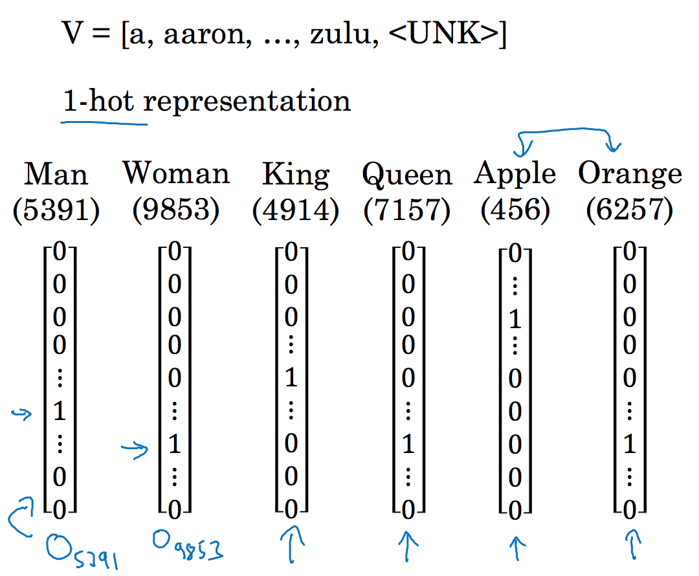
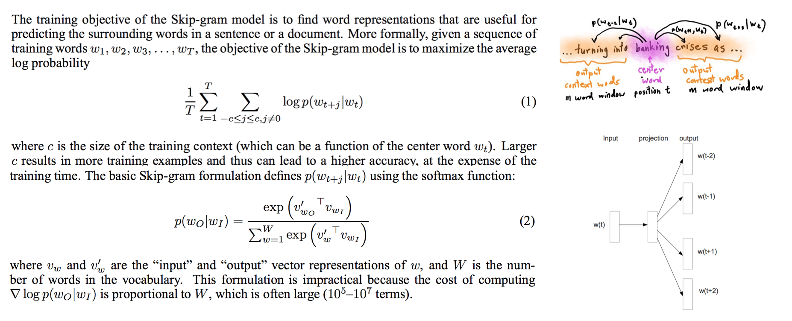
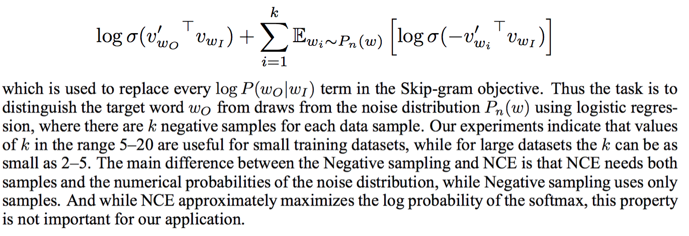

# Word Embeddings

_Notes below are adapted from Stanford's CS 224N notes, all rights belong to the course creataor._ 

## Table of Contents

* [Discrete Representation: One-Hot Encoding](https://github.com/robert8138/deep-learning-deliberate-practice/blob/master/concepts/word_embeddings.md#discrete-representation-one-hot-encoding)

* [Distributional Representation: Word Embeddings using Word2Vec](https://github.com/robert8138/deep-learning-deliberate-practice/blob/master/concepts/word_embeddings.md#distributional-representation-word-embeddings-using-word2vec)
	* [Word2Vec](https://github.com/robert8138/deep-learning-deliberate-practice/blob/master/concepts/word_embeddings.md#word2vec)
	* [Skip Gram Model](https://github.com/robert8138/deep-learning-deliberate-practice/blob/master/concepts/word_embeddings.md#skip-gram-sg-model)
	* [Negative Sampling](https://github.com/robert8138/deep-learning-deliberate-practice/blob/master/concepts/word_embeddings.md#negative-sampling)

* [Co-occurrence Matrix & GloVe](https://github.com/robert8138/deep-learning-deliberate-practice/blob/master/concepts/word_embeddings.md#co-occurrence-matrix--glovec)
	* [Co-occurrence Matrix](https://github.com/robert8138/deep-learning-deliberate-practice/blob/master/concepts/word_embeddings.md#co-occurrence-matrix)
	* [Global Vectors](https://github.com/robert8138/deep-learning-deliberate-practice/blob/master/concepts/word_embeddings.md#global-vectors-glove)
		* [Prior Work](https://github.com/robert8138/deep-learning-deliberate-practice/blob/master/concepts/word_embeddings.md#prior-work)
		* [GloVe]()

* [Visualization of Embeddings]
* [Evaluation of Embeddings]

## Discrete Representation: One-Hot Encoding

Word representation are the foundation of any statistical NLP algorithms. Historically, many of the NLP tasks represent word tokens using [one-hot encoding](http://scikit-learn.org/stable/modules/generated/sklearn.preprocessing.OneHotEncoder.html). In this encoding scheme, we first take a text corpus, extract a **bag of words** ("bag" is to denote that the ordering of the words are lost), and then encode each word in the bag as a vector by setting the element position of our target word to be 1, and 0 elsewhere. For unseen words, we will often encode a new word token in the bag as `<unkonwn>`.

Problems with one-hot encoding:

* The dimensionality of the one-hot encoded vectors can be enormous (dimension = cardinality of the bag of words)
* There is no natural notion of similarity for words that are similar / disimilar. The dot product of the word vectors will all be 0.



Sometimes people would attempt to use **featurized word representation**, but this is often limited because we need to explicitly define what each element in the vector representation captures (i.e. they are not learned). However, this approach motivates distributional representation of words.

## Distributional Representation: Word Embeddings using Word2Vec

The idea behind distributional representation of a word can be summarized by the following quote:

```
"You shall know a word by the company it keeps"
```

Distributed representations of words in a vector space help learning algorithms to achieve better performance in natural language processing tasks by grouping similar words. This idea has since been applied to statistical language modeling with considerable success to applications such as automatic speech recognition, machine translation, and a wide range of NLP tasks.

The basic idea beyond distributed representation is simple - we can represent a word really well by the words surrounding it. The advantage of this learned representation is that words that are similar to each other will have high (say, cosine) similarity, and words that are disimilar would be far away from each other. Furthermore, the user has controls on what should be the dimensionality of the word representation (often low). We commonly referred to these learned word representation **Word Embeddings**.

### Word2Vec

The name Word2Vec come from the fact that for each word (`Word`), we are learning a word representation where the word can be represented as a vector (`Vec`). The way that Jeremy Howard put it is that word embeddings are like a **look-up table**: given a key that is a word token, the embedding matrix will return you a word embedding vector.

### Skip-Gram (SG) Model

[Mikolov et al.](https://arxiv.org/pdf/1310.4546.pdf) introduced the Skip-gram model, an efficient method for learning highquality vector representations of words from large amounts of unstructured text data. Unlike most of the previously used neural network architectures for learning word vectors, training of the Skipgram model does not involve dense matrix multiplications. This makes the training extremely efficient: an optimized single-machine implementation can train on more than 100 billion words in one day.



**Important Intuition**: because of the softmax function, words that co-occur within the "radius" would have higher probability - this also means that the dot product of the co-occuring words will be high, which effectively is the cosine similarity of two vectors (when they both have norm 1). This learning algorithm therefore **force co-occuring words to have high similarity**.

**Note**: From the above formula is that the parameters of the model we are trying to learned are the two pairs of embeddings: one embeddings for the context word (`o`) and another one for embeddings for the target word (`t`). In other words, every word has two vectors!

Below is an illustration of how we compute the loss function of this Skip-Gram word2vec model:


With the loss function and optimization set up, we can start taking derivatives of the loss function w.r.t to the embeddings. Details of this derivation can be found from [CS 224 lecture notes](). You can also watch the [video lecture]() from Professor Manning.

### Negative Sampling

As mentioned above, the formulation above is impractical because the denominator term involves calculating dot products that is proportional to the number of words in the vocabulary set. One approach to solve this issue is Noise Contrasive Estimation (NCE). While NCE can be shown to approximately maximize the log probability of the softmax, the Skip-Gram model is only concerned with learning high quality word representations. So in practice, NCE is simplified to to Negative Sampling (as long as the word embeddings retain its quality):



**Main Idea:** Train binary logistic regression (notice the \sigma) for a true pair (center word and the word in the context window) v.s. a couple of noise pairs (the center word paired with a random word, most likely not in the context window). We want to maximize the probability that the true pair, and minimize the probabilities of the noise pairs. This effectively make true pairs closer (with higher similarity / dot product), and noise pairs further (low similarity / dot product).

Typically, the sampling probability distribution takes the unigram distribution, raised to the 3/4 power to make less frequent word be sampled more often.

## Co-occurrence Matrix & GloVe

### Co-occurrence Matrix

The intuition behind Word2Vec is to capture **co-occurence** of pairs of words, so why not directly capture co-occurrence count? We can achieve this by using Window-based co-occurrence matrix. The window size is a parameter that can be tuned, and the matrix is symmetric. 

One problem with using the window-based co-occurrence matrix is that this matrix increases with the size of the vocabulary. It's very high dimensional and suffers from sparsity issues. One way to combat this is to leverage matrix decomposition such as SVD to store most of the information in a "fixed", small number of dimensions. This works, but with great computational burden (cost scales quadratically for a `n x m` matrix). 

### Global Vectors (GloVe)

#### Prior Work

[Pennington, Socher, and Manning](https://www.aclweb.org/anthology/D14-1162) developed GloVe: a new global logbilinear regression model that combines the advantages of the two major model families in the literature: global matrix factorization and local context window methods. This model efficiently leverages statistical information by training only on the nonzero elements in a word-word cooccurrence matrix, rather than on the entire sparse matrix or on individual context windows in a large corpus. The model produces a vector space with meaningful substructure. [Section 2](https://www.aclweb.org/anthology/D14-1162) of the paper summarized related work and how it motivated GloVe:

* **Matrix Factorization Methods**: Matrix factorization methods for generating low-dimensional word representations have roots stretching as far back as LSA. These methods utilize low-rank approximations to decompose large matrices that capture statistical information about a corpus. The particular type of information captured by such matrices varies by application. In LSA, the matrices are of “term-document” type, i.e., the rows correspond to words or terms, and the columns correspond to different documents in the corpus. 

* **Shallow Window-Based Methods**: Another approach is to learn word representations that aid in making predictions within local context windows. Works from Bengio (2003)  introduced a model that learns word vector representations
as part of a simple neural network architecture for language modeling. Recently, the importance of the full neural network structure for learning useful word representations has been called into question. The skip-gram and continuous bag-of-words (CBOW) models of Mikolov et al. (2013a) propose a simple single-layer architecture based on the inner product between two word vectors.

A main problem with LSA and related methods is that the most frequent words contribute a disproportionate amount to the similarity measure. Unlike the matrix factorization methods, the shallow window-based methods suffer from the
disadvantage that they do not operate directly on the co-occurrence statistics of the corpus. Instead, these models scan context windows across the entire corpus, which fails to take advantage of the vast amount of repetition in the data.

#### GloVe


* Traditional Word Representation
	* [Colab's Explanation on Word Embeddings](https://colah.github.io/posts/2014-07-NLP-RNNs-Representations/)